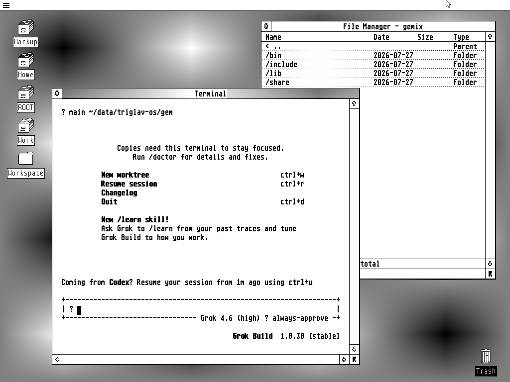

# GEM for Linux

GEM for Linux brings the classic GEM graphical environment to modern Linux. It
provides the GEM Desktop, windows, menus and dialogs together with a file
manager, terminal and sample applications.

GEM can run in a Rasta viewer on a hosted development machine, or directly on
a Linux framebuffer with keyboard and mouse input from the Linux text console.



See [What's new](CHANGELOG.md) for recent changes.

## Build

Requires Linux, GCC/G++, GNU Make, CMake 3.20+, Git, Python 3, pkg-config,
SDL2 development files and ImageMagick. The build downloads and verifies
pinned Rasta and Musashi source archives into ignored `build/` storage.
Subsequent builds reuse them; no separate checkouts are needed.
From the repository root:

```sh
make
make tests    # optional; results in docs/tests/LATEST.md
```

Alternatively, `make container` builds and tests using Docker; the host needs
Docker and GNU Make instead of the compiler dependencies. The first build
needs internet access. See the [build guide](docs/guides/HOSTED_DEVELOPMENT.md).

## Run with Rasta

Start these commands in three separate terminals, in order. Wait for gemd
to report that it is listening before starting the desktop:

```sh
./bin/tools/rasta --inverse --port 5000
./bin/core/gemd
./bin/apps/desktop
```

Alternatively, press F5 with **GEM — Desktop and Terminal** in VS Code to
start those two applications together. See the
[hosted development guide](docs/guides/HOSTED_DEVELOPMENT.md) for setup and the
[samples guide](docs/guides/SAMPLES.md) for SDK builds.

## Run on a Linux framebuffer

For a text-console system with Linux framebuffer and evdev support, build the
native package:

```sh
cmake -S . -B build -DCMAKE_BUILD_TYPE=Release -DGEM_PLATFORM=linux
cmake --build build --target gemix_package -j"$(nproc)"
```

Run it from a Linux virtual console. The account needs access to `/dev/fb0` and
the keyboard and pointer devices under `/dev/input`:

```sh
export GEM_RESOURCE_DIR="$PWD/bin/gemix/share/gem"
./bin/gemix/bin/gemd &
while [ ! -S /tmp/gemd.sock ]; do sleep 0.02; done
./bin/gemix/bin/desktop
```

Copy the complete `bin/gemix` directory to install it elsewhere. See the
[native Linux guide](docs/guides/GEMIX_LINUX.md) for device selection,
permissions and deployment configuration.
